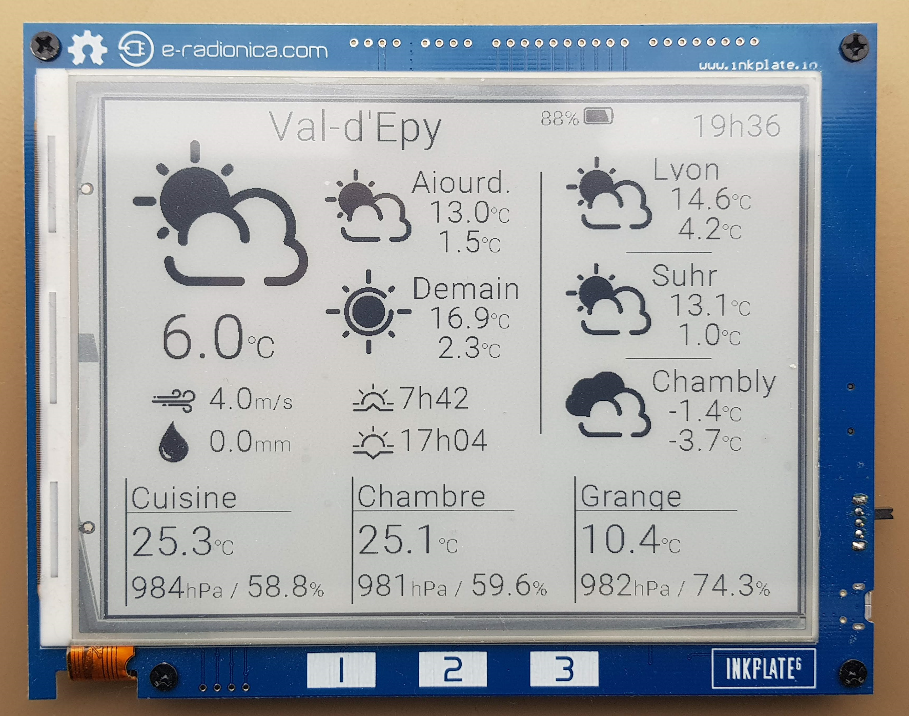

# An Inkplate 6 Hassio Dashboard
This Git features a simple Arduino project to use an Inplate 6 as a Home Assistant dashboard through API calls. The idea is to have a nice passive display to keep at your place. Inkplate allows very good battery durability through the eink technology and it is less flashy than a LCD / LED display!

This work was hugely based on the e-Radionica tutorial: [Real time Weather station](https://github.com/e-radionicacom/Inkplate-6-Arduino-library/tree/master/examples/Projects/Hourly_weather_station_example). Kudos to the team!


# Dashboard
## Example
In its current status, the program is meant as a Home Assistant Hub, mostly used for weather and temperature monitoring.
It displays Temperature/Pressure/Humidity of 3 sensors, local actual weather and forecast, and forecast for remote places.

__Protection film on the screen explains some artefacts. Display is very nice! Small pictures in poor lighting conditions__



## How it works
The Inkplate fetches information from the Home Assistant (HA / Hassio) server through **API calls** (HTTP GET requests). It can get any information from the HA server: sensors, states, weather, etc. Everything is within a Json object, easy to extract!

The information is rendered on the plate using **simple functions**.
Icons are png pictures converted to 1bit or 3bits PROGMEM variables. No SD card needed.

The plate is sleeping between calls, which should save battery. A time-stamp is added to check if it is still updating.
Updates are **differentiated**: sensors updated regularly, weather forecasts not!

The project is for now in **1bit mode** is an option. With the right icons, BW is not an issue and it unlock the discrete partial update: no more flashing! With 3bits, 8 shades from black to white are possible, allowing background and other features, at the cost of the partial update capability.

## Pre-requesites
This project requires the following elements:
* An Inkplate 6 from [e-radionica](https://e-radionica.com/en/inkplate.html)
* Arduino IDE + eventually an external code editor (for example VS Code with Arduino extension)
* All the [librairies](https://github.com/e-radionicacom/Inkplate-6-Arduino-library#setting-up-inkplate-6-in-arduino-ide) to have the Inkplate up and running
* An [Home Assistant](https://www.home-assistant.io/) server, with specific settings defined below
* Something to check your API is strongly recommended. I personally used [Postman](https://www.postman.com/)

## Partial updates
The guys from e-radionica had the partial updates in mind when they developed the Inkplate. Not only the global refresh is quite fast, but th epartial update is very fast and discrete!

It works only in 1bit mode, here is a demo (custom controllers addition in progress):


# Configuration
## Home Assistant
### Setup
I personnally used Balena to set my HA server up. It was very convenient, I like especially the simplicity and the nice remote management to restart containers, check logs, etc.
Check their tutorial [there](https://www.balena.io/blog/monitor-air-quality-around-your-home-with-home-assistant-and-balena/)

I don't see anything that would force you to a specific HA installation / version. Full access to the ```configuration.yaml``` is required.

### Sensors
Install / set your sensors through the web UI. Nothing particualar here. Make sure you change the entities names now, so you don't have to reconfigure it later.

To have weather forecasts in different places, you should set the integrations.

### Configuration.yaml & API
Once HA is configured, we should setup the API.
* Update the ```configuration.yaml``` file to allow the API. An example is given [here](doc/configuration.yaml)
* Create a [long-lived access token](https://developers.home-assistant.io/docs/auth_api/#long-lived-access-token) to access the API. Use the Web UI to do it: ```Web UI > User > Long-lived access tokens```

## Inkplate
Please run an example to make sure compilation, transfer and execution are OK.

On the Inkplate 6, you need to change the Arduino file with your configurations. Obviously, it is unlikely you'll keep the same as me, but adapting should be quite easy.

Minimal things to change:
* Edit the ```Secrets_example.h``` and save it to ```Secrets.h```. This file contains sensitive information that will not be visible to others when you share your cide!
  * WiFi credentials: ```ssid``` and ```password```
  * Home Assistant API adress and long-lived access token

Other changes:
* Sensor and Cities names are defined in the ```Fields_definitions.h```.
* Although many things are also hard coded in ```Network.cpp``` and should be edited to redirect to your sensors / states
* The UI arrangment is defined in the main ```.ino```, along with the selective refresh rates.

Note that I used weather modules from *Norwegian Meteorological Institute* and *Météo-France*, which both use the same standard [Weather entity](https://developers.home-assistant.io/docs/core/entity/weather/). If you use another provider, you will have to adapt it. I prefered to use HA but sending a direct call to an API like [OpenWeatherMap](https://openweathermap.org/api) is perfectly possible. Limit of number of calls should be considered!

# Miscellaneous
## Image conversion
The Inkplate librairie allows to load pictures from an SD card. However this can be an overkill for such projects. Additionally, it is faster and more efficient to have the pixture already in memory, considering there is no memory issues.

e-radionica.com team setup a [service](https://inkplate.io/home/image-converter/) to convert pictures online, to 1bit or 3bits, even handling resizing and dither.
However, this can be limiting for processing multiple pictures.

The existing python file from the Inkplate librairy example was adapted to handle 3bit outputs and resizing. Here is the process:
* Setup an ```Python3``` environment with ```Pillow``` librairy
* Copy the image to convert into the ```icons_to_binary``` folder
* Edit the Python script to match your parameters
  * ```TESTING```: True to export only the first picture and have it displayed.
  * ```output_3bit```: True to export as 3bit, False to have 1bit images.
  * ```threshold_1bit```: Pixel value [0..255] defining the limit for 1bit cases (ignored if 3bit).
  * ```resize_w```: Target width (preserves ratio). Negative number to desactivate.
  * ```invert_colors```: Will invert the colors in the output.
  * ```channel_to_consider```: Channel to consider from the picture. ```R``` to consider the R from RGB values. ```L``` will convert the picture into grayscale and use it. ```A``` is also possible to use only the alpha channel (if present). Note the input image is always converted to RGBA to avoid channel issues.
  * ```consider_alpha```: For many PNGs, the *transparent* areas do not have a RGB of (0, 0, 0). Therefore, when set to True, the ```channel_to_consider``` is multiplied by the alpha channel to also remove these parts. The alpha channel is inversed before multiplication (```out = channel_to_consider * (255 - alpha_channel```)


## API basic check
The following lines allow you to check the API behavior in Postman. This is much more convenient than doing it within Arduino!

Postman should be configured with GET requests with:
1. The adress ```http://your.HA.server.IP/api/what-you-are-looking-for```
2. Headers:
   1. ```Authorization```: ```Bearer your-long-lived-token```
   1. ```Content-Type```: ```application/json```

An ```401``` error indicates a problem with the long-lived access token.

Examples of requests: (please replace with your server's IP)
* Basic check of your API server: ```http://192.168.1.33/api/config```
* Checking the long-lived-token: ```http://192.168.1.33/api/states/sun.sun```
* Checking the your sensor data: ```http://192.168.1.33/api/states/sensor.chambre_temperature```
* Checking the weather: ```http://192.168.1.33/api/states/weather.val_d_epy```
* Checking the custom sensors defined in the YAML: ```http://192.168.1.33/api/states/sensor.nextsunrise```

## Mentions
* Lot of this is based on e-radionica [examples](https://github.com/e-radionicacom/Inkplate-6-Arduino-library/tree/master/examples)
* Current set of icons is from [Freepik](https://www.flaticon.com/authors/freepik), from [Flaticon](www.flaticon.com)
* During my researches for this project, I saw [this Reddit post](https://www.reddit.com/r/homeassistant/comments/h9yoes/first_glimpse_of_low_power_eink_dashboard/) which has a completly different approach that I find quite interesting. The setup is a bit more complex as he ended with a monitor on the HA server. Happy reading.